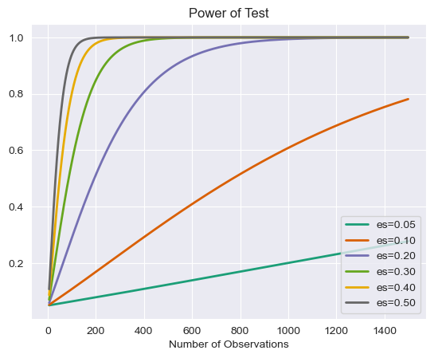

# Statistical Power

## Introduction


In hypothesis testing, the decision to fail to reject or reject the null hypothesis is made by comparing the *p*-value to $\alpha$, which is the stipulated probability of making a Type I error (False Positive). A Type I error is incorrectly rejecting a true null hypothesis. This lesson considers *power*, which is related to the Type II error (False Negative). In particular, power is the probability of *not* making a Type II error, i.e. correctly rejecting a false null hypothesis.

## Objectives

You will be able to:

- Define power in relation to p-value and the null hypothesis 
- Describe the impact of sample size and effect size on power 
- Perform power calculation using SciPy and Python 
- Demonstrate the combined effect of sample size and effect size on statistical power using simulations 


## The power of a statistical test

The power of a statistical test is defined as the probability of rejecting the null hypothesis, given that it is indeed false. As with any probability, the power of a statistical test, therefore, ranges from 0 to 1, with 1 being a perfect test that guarantees rejecting the null hypothesis when it is actually false. Mathematically, power is the complement of $\beta$, which is the probability of a Type II error.

In particular, $power = 1 - \beta$.

For a given $\alpha$ value, an optimal threshold for rejecting the null hypothesis can be determined. That is, for a given $\alpha$ value, you can calculate a threshold that maximizes the power of the test. Note that while $\alpha$ does not depend on a particular value of $\beta$, the power of the test does depend on the level of significance $\alpha$.


> Note: Ideally, $\alpha$ and $\beta$ would both be minimized, but this is often costly, impractical or impossible depending on the scenario and required sample sizes. 


## Effect size

The effect size is the magnitude of the difference you are testing between the two groups, i.e. it is a measure of how much the truth differs from chance or a control condition. Cohen's *d* is typically the metric used as the effect size. 

Cohen's *d* is defined as:  $ d = \frac{m_1 - m_2}{s}$,  where $m_1$ and $m_2$ are the respective sample means and s is the overall standard deviation of the samples. 

> When looking at the difference of means of two populations, Cohen's D is equal to the difference of the sample means divided by the pooled standard deviation of the samples. The pooled standard deviation of the samples is the average spread of all data points in the two samples around their group mean.  


## Power analysis

Since $\alpha$, power, sample size, and effect size are all related quantities, it is useful to look at some plots of the power of some t-tests, given varying sample sizes. This will allow you to develop a deeper understanding of how these quantities are related and what constitutes a convincing statistical test. There are three things to go into the calculation of power for a test. They are:

* alpha value
* effect size
* sample size   

A fantastic visual representation of these values' effect on one another can be found on [Kristoffer Magnusson's website](https://rpsychologist.com/d3/NHST/).

Let's look at how power might change in the context of varying effect size. To start, imagine the scenario of trying to detect whether or not a coin is fair. In this scenario, the null-hypothesis would be $H_0(heads) = 0.5$ because our assumption is that we are dealing with a fair coin. From here, the power will depend on both the sample size and the effect size (that is the threshold for the null hypothesis to be rejected). For example, if the alternative hypothesis has a large margin from the null-hypothesis such as $H_a(heads) = 0.8$ or $H_a(heads) = 0.9$ (large effect size), then there is a higher chance of rejecting the null-hypothesis (power is increased). If there is a smaller margin between the null hypothesis and an alternate hypothesis, an unfair coin where $P(heads)=.6$ for example (small effect size), there is a lower chance of rejecting the null hypothesis (power is reduced).

To start, you might choose an alpha value that you are willing to accept such as $\alpha=0.05$. From there, you can observe the power of various statistical tests against various sample and effect sizes.  

For example, if we wish to state the alternative hypothesis $H_a = .55$, then the effect size (using Cohen's *d*) would be:

$ d = \frac{m_1 - m_2}{s}$  
$ d = \frac{.55 - .5}{s}$

Furthermore, since we are dealing with a binomial variable, the standard deviation of the sample should follow the formula $\sqrt{n\bullet p(1-p)}$.  
So some potential effect size values for various scenarios might look like this:


```python
import numpy as np
import pandas as pd
```

Since we are using the z-distribution to approximate the binomial in the formula for *d* below, we need to use the expected value rather than than the probability. As such, we multiply *m1* and *m2* each by *n* within the `for` loops in the code chunks that follow. (We are assuming that is appropriate to use the normal approximation of the binomial.)


```python
m1 = .55
m2 = .5
p = m2
rows = []
for n in [10, 20, 50, 500]:
    std = np.sqrt(n*p*(1-p))
    d = (m1*n-m2*n)/std
    rows.append({'Effect_Size': d, 'STD': std, 'Num_observations': n})
print('Hypothetical effect sizes for p(heads)=.55 vs p(heads)=.5')
pd.DataFrame(rows)
```

    Hypothetical effect sizes for p(heads)=.55 vs p(heads)=.5


<div>
<style scoped>
    .dataframe tbody tr th:only-of-type {
        vertical-align: middle;
    }

    .dataframe tbody tr th {
        vertical-align: top;
    }

    .dataframe thead th {
        text-align: right;
    }
</style>
<table border="1" class="dataframe">
  <thead>
    <tr style="text-align: right;">
      <th></th>
      <th>Effect_Size</th>
      <th>STD</th>
      <th>Num_observations</th>
    </tr>
  </thead>
  <tbody>
    <tr>
      <th>0</th>
      <td>0.316228</td>
      <td>1.581139</td>
      <td>10</td>
    </tr>
    <tr>
      <th>1</th>
      <td>0.447214</td>
      <td>2.236068</td>
      <td>20</td>
    </tr>
    <tr>
      <th>2</th>
      <td>0.707107</td>
      <td>3.535534</td>
      <td>50</td>
    </tr>
    <tr>
      <th>3</th>
      <td>2.236068</td>
      <td>11.180340</td>
      <td>500</td>
    </tr>
  </tbody>
</table>
</div>


We see that effect size increases as the sample size increases. Here's the same idea expanded to other alternative hypotheses:


```python
m2 = .5 # null value
rows = {}
for n in [10, 20, 50, 500]:
    temp_dict = {}
    for m1 in [.51, .55, .6, .65, .7, .75, .8, .85, .9]: # p hats
        p = m2 # this is wrong
        std = np.sqrt(n*p*(1-p)) # this is correct
        d = (m1*n-m2*n)/std # this is correct
        temp_dict[m1] = d
    rows[n] = temp_dict
print('Hypothetical effect sizes for various alternative hypotheses')
df = pd.DataFrame.from_dict(rows, orient='index')
# df.index = [10,20,50, 500]
# df.index.name = 'Sample_Size'
# df.columns.name = 'Alternative Hypothesis'
df
```

    Hypothetical effect sizes for various alternative hypotheses


<div>
<style scoped>
    .dataframe tbody tr th:only-of-type {
        vertical-align: middle;
    }

    .dataframe tbody tr th {
        vertical-align: top;
    }

    .dataframe thead th {
        text-align: right;
    }
</style>
<table border="1" class="dataframe">
  <thead>
    <tr style="text-align: right;">
      <th></th>
      <th>0.51</th>
      <th>0.55</th>
      <th>0.60</th>
      <th>0.65</th>
      <th>0.70</th>
      <th>0.75</th>
      <th>0.80</th>
      <th>0.85</th>
      <th>0.90</th>
    </tr>
  </thead>
  <tbody>
    <tr>
      <th>10</th>
      <td>0.063246</td>
      <td>0.316228</td>
      <td>0.632456</td>
      <td>0.948683</td>
      <td>1.264911</td>
      <td>1.581139</td>
      <td>1.897367</td>
      <td>2.213594</td>
      <td>2.529822</td>
    </tr>
    <tr>
      <th>20</th>
      <td>0.089443</td>
      <td>0.447214</td>
      <td>0.894427</td>
      <td>1.341641</td>
      <td>1.788854</td>
      <td>2.236068</td>
      <td>2.683282</td>
      <td>3.130495</td>
      <td>3.577709</td>
    </tr>
    <tr>
      <th>50</th>
      <td>0.141421</td>
      <td>0.707107</td>
      <td>1.414214</td>
      <td>2.121320</td>
      <td>2.828427</td>
      <td>3.535534</td>
      <td>4.242641</td>
      <td>4.949747</td>
      <td>5.656854</td>
    </tr>
    <tr>
      <th>500</th>
      <td>0.447214</td>
      <td>2.236068</td>
      <td>4.472136</td>
      <td>6.708204</td>
      <td>8.944272</td>
      <td>11.180340</td>
      <td>13.416408</td>
      <td>15.652476</td>
      <td>17.888544</td>
    </tr>
  </tbody>
</table>
</div>


The realistic effect sizes for this scenario could be anywhere from 0.06 (or lower) up to approximately 17. 

Once there are some parameter estimates for $\alpha$ and the effect size, one can map subsequent relationships for the power and sample size. Again, this is because any three of these quantities ($\alpha$, effect size, sample size and power) will determine the fourth.  

A common statistical test for comparing sample means is the *t*-test. Statsmodels has some convenient build in functions for calculating the power of a *t*-test and plotting power curves:


```python
from statsmodels.stats.power import TTestIndPower, TTestPower
import matplotlib.pyplot as plt
import seaborn as sns
%matplotlib inline
sns.set_style('darkgrid') # Nice background styling on plots
```


```python
power_analysis = TTestIndPower()
```


```python
power_analysis.plot_power(dep_var='nobs',
                          nobs = np.array(range(5,1500)),
                          effect_size=np.array([.05, .1, .2,.3,.4,.5]),
                          alpha=0.05)
plt.show()
```


    

    


As this should demonstrate, detecting small perturbances can be quite difficult.

Similarly, just because a t-test has an incredibly small p-value doesn't necessarily imply a strong statistical test. As is mentioned in the article *Using Effect Size - or Why the P Value Is Not Enough*, referenced below, using incredibly large sample sizes such as 22,000 can make even the most trivial effect size statistically significant. Realizing these reciprocal relationships and considering all 4 parameters: alpha, effect size, sample size, and power are all important when interpreting the results (such as the p-value) of a statistical test.

In addition to plotting a full curve, you can also calculate specific values. Simply don't specify one of the four parameters.

We can also draw the following conclusion from the plot above: **For a specific sample size (*x*-axis), power increases (*y*-axis) as effect size increases.**


```python
# Calculate power
power_analysis.solve_power(effect_size=.2, nobs1=80, alpha=.05)
```


    0.24175778678474175


```python
# Calculate sample size required
power_analysis.solve_power(effect_size=.2, alpha=.05, power=.8)
```


    393.4056989990348


```python
# Calculate minimum effect size to satisfy desired alpha and power as well as respect sample size limitations
power_analysis.solve_power(nobs1=25, alpha=.05, power=.8)
```


    0.808707788668041


```python
# Calculate alpha (less traditional)
power_analysis.solve_power(nobs1=25, effect_size=.3, power=.8)
```


    0.6613634273431549


You can also simulate your own data to verify results:


```python
import scipy.stats as stats
def run_ttest_sim(p1, p2, std, nobs, alpha=0.05, n_sim=10**5):
    """p1 and p2 are the underlying means probabilities for 2 normal variables
    Samples will be generated using these parameters."""
    # Calculate Normalized Effect Size
    effect_size = np.abs(p1-p2)/std
    
    # Run a Simulation
    # Initialize array to store results
    p = (np.empty(n_sim))
    p.fill(np.nan)

    #  Run a for loop for range of values in n_sim
    for s in range(n_sim):
        control = np.random.normal(loc= p1, scale=std, size=nobs)
        experimental = np.random.normal(loc= p2, scale=std, size=nobs)
        t_test = stats.ttest_ind(control, experimental)
        p[s] = t_test[1]
    
    num_null_rejects = np.sum(p < alpha)
    power = num_null_rejects/n_sim
    # Store results
    stat_dict = {'alpha':alpha,
                 'nobs':nobs,
                 'effect_size':effect_size,
                 'power': power}
    return stat_dict

run_ttest_sim(.5, .7, 1, 50)
```


    {'alpha': 0.05,
     'nobs': 50,
     'effect_size': 0.19999999999999996,
     'power': 0.16789}


And going back to the full stats model implementation for verification:


```python
power_analysis.solve_power(nobs1=50, effect_size=0.19999999999999996, alpha=0.05)
```


    0.1676754863454749


```python
power_analysis.solve_power(nobs1=50, effect_size=0.19999999999999996, power=0.16719)
```


    0.04977951582621217


```python
power_analysis.solve_power(nobs1=50, power=0.16719, alpha=0.05)
```


    0.1995971006944531


```python
power_analysis.solve_power(power=0.16719, effect_size=0.19999999999999996, alpha=0.05)
```


    49.80313313853305


## Additional Resources

* [Statsmodels documentation](http://www.statsmodels.org/dev/generated/statsmodels.stats.power.TTestIndPower.html)
* [Using Effect Size—or Why the P Value Is Not Enough](https://www.ncbi.nlm.nih.gov/pmc/articles/PMC3444174/)
* [Understanding Statistical Power and Significance Testing - an interactive visualization](https://rpsychologist.com/d3/NHST/)

## Summary

In this lesson, you learned about the idea of "statistical power" and how sample size, alpha, and effect size impact the power of an experiment. Remember, the power of a statistical test is the probability of rejecting the null hypothesis when it is indeed false.
